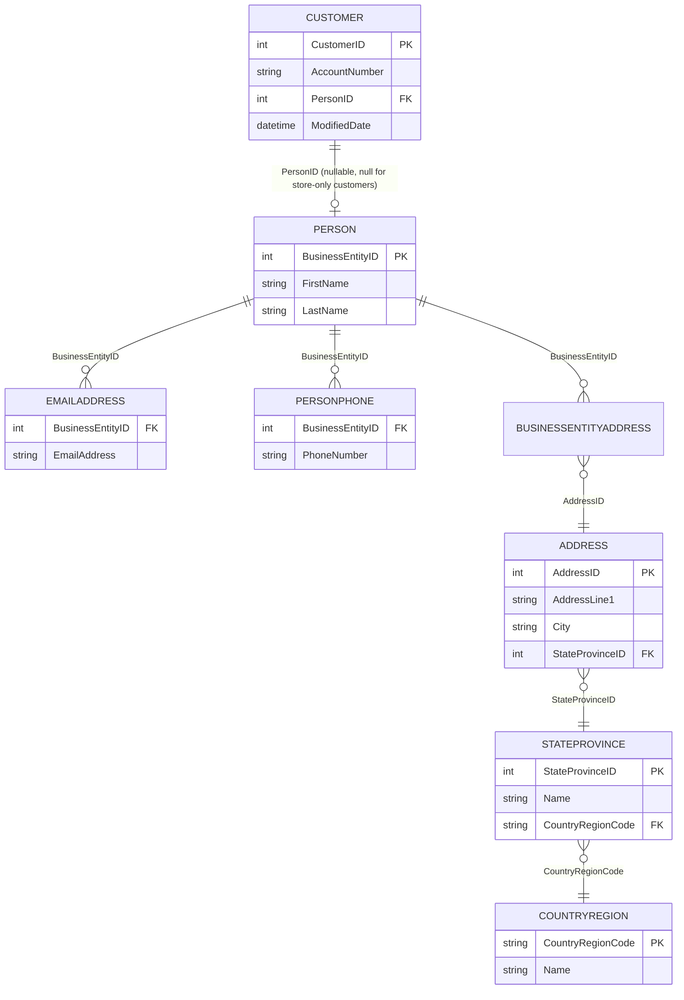
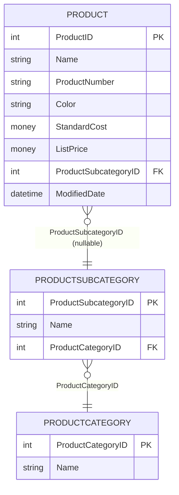
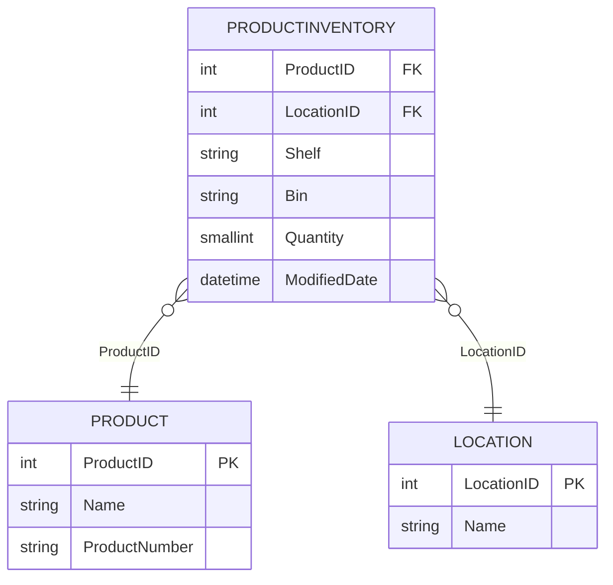
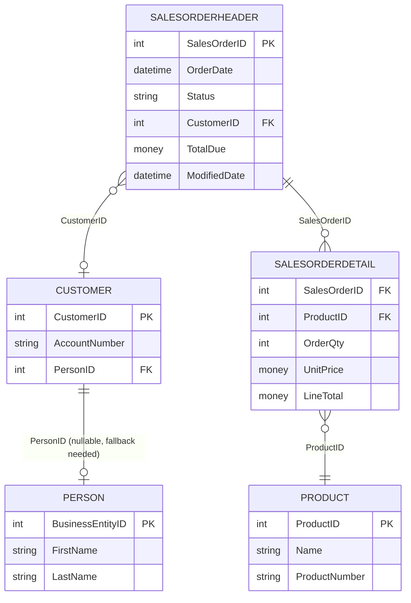

# Sync Agent Development Plan (Fully Granular — EF Core Data Access)

## Understanding
Build a .NET 8 always-on "Sync Agent" app that polls the existing `SyncPlatform` WPF test app's embedded HTTP server (`http://localhost:5100`, header `X-Api-Key: candidate-test-key-2026`) for tasks (`GET /api/sync/next-task`), executes the matching AdventureWorks query for one of four task types via **EF Core**, and reports results (`POST /api/sync/result`). Every step that changes files has its own commit message; implementation and its tests are split into separate commits.

## Correction From Full-Repo Review
The solution **must be built inside the `candidate/` directory** (confirmed via `README.md` and the `candidate\.gitkeep` placeholder) — NOT inside `src/SyncPlatform/`, which is the read-only simulator. New projects: `candidate\SyncAgent\` (Worker Service) and `candidate\SyncAgent.Tests\` (xUnit), in their own solution, independent of `src\SyncPlatform\SyncPlatform.sln`.

## Data Access Decision: EF Core (Database-First, Code-Only Mapping)
User prefers EF Core over Dapper. Approach: **scaffold/hand-write a minimal `AdventureWorksDbContext`** covering only the ~15 tables actually needed:

1. `Sales.Customer`
2. `Person.Person`
3. `Person.EmailAddress`
4. `Person.PersonPhone`
5. `Person.BusinessEntityAddress`
6. `Person.Address`
7. `Person.StateProvince`
8. `Person.CountryRegion`
9. `Production.Product`
10. `Production.ProductSubcategory`
11. `Production.ProductCategory`
12. `Production.ProductInventory`
13. `Production.Location`
14. `Sales.SalesOrderHeader`
15. `Sales.SalesOrderDetail`

...rather than scaffolding the entire 70+ table database — keeps the model lean and scoped to the sync agent's actual needs. (A 16th table, `Sales.Store`, may be added during `GetOrders` implementation if store-only customer fallback needs it.) Entities are **read-only** (`AsNoTracking()` everywhere, no change tracking needed since this app never writes to AdventureWorks). LINQ queries replace raw SQL, but join/filter logic (verified against `sys.foreign_keys`) stays the same:

- **GetCustomers**: `Customers` (where `PersonID != null`) with projection to first email, first phone, and address chain (Address -> StateProvince -> CountryRegion) via `.Select()` with `.FirstOrDefault()` sub-projections (LINQ equivalent of `OUTER APPLY TOP 1`, avoiding row fan-out from `Include` on collections).
- **GetProducts**: `Products` with navigation to `ProductSubcategory.ProductCategory`.
- **GetProductInventory**: `ProductInventories` with navigation to `Product` and `Location`.
- **GetOrders**: `SalesOrderHeaders` with `Include(o => o.SalesOrderDetails).ThenInclude(d => d.Product)` (using `AsSplitQuery()` to avoid fan-out) and projection to `Customer.Person`, filtered by `ModifiedDate`, then projected/grouped into the nested `OrderDto.OrderDetails` shape.
- All queries filtered server-side by `ModifiedDate >= modifiedSince` (parameterized automatically by EF Core).

## Verified Facts (from full source + schema inspection)
- Endpoint `http://localhost:5100`; header `X-Api-Key: candidate-test-key-2026`; wrong/missing key -> `401`.
- `GET /api/sync/next-task` -> `200` with task JSON, or `204` empty body when queue empty.
- `SyncTask`: `taskId` (opaque ULID string), `taskType`, `parameters` (`Dictionary<string,string>`; `modifiedSince` always sent by the test harness but not guaranteed by contract), `createdAt`.
- `SyncResult`: `taskId`, `taskType`, `status` (`"completed"|"failed"` only), `data` (array or null), `recordCount`, `executedAt`, `errorMessage`. Server 400s on missing `taskId`/`taskType`/invalid `status`/empty body/invalid JSON.
- `docs/sample-payloads/error-result.json` confirms exact failed-task shape.
- Exact result-record shapes per task type confirmed from `docs/sample-payloads/result-*.json`.
- `CHALLENGE_SUBMISSION.md` fixed sections: Candidate, How to Run, Architecture Decisions, Security Measures, Testing Strategy, Known Limitations, AI Tools Used, Time Spent, Feedback.

## Assumptions
- EF Core with `Microsoft.EntityFrameworkCore.SqlServer` provider; `AdventureWorksDbContext` resolved per polling cycle via `IServiceScopeFactory` (scoped lifetime), not injected directly into the singleton `BackgroundService`.
- Reusability via `ITaskHandler` strategy interface + DI dispatcher keyed by `taskType` — layered/strategy-pattern design, no DDD.
- Testing via xUnit + Moq; repository tests use EF Core's InMemory or Sqlite in-memory provider seeded with sample data.
- Security/abuse-prevention: HttpClient timeouts, bounded retry/backoff, no secrets in logs, EF Core's parameterized LINQ (no raw SQL/string concatenation), safe `modifiedSince` parsing with graceful fallback.
- Nullable reference types enabled project-wide for compiler-enforced null safety (e.g., store-only customers with null `PersonID`).

## Table Relationship Diagrams

### 1. GetCustomers

Filter: `Customer.ModifiedDate >= modifiedSince`, `PersonID != null`. Email/phone/address pulled as "first match" scalar sub-projections to avoid fan-out.

### 2. GetProducts

Filter: `Product.ModifiedDate >= modifiedSince`. Simple one-to-one/many-to-one navigations, no fan-out risk.

### 3. GetProductInventory

Filter: `ProductInventory.ModifiedDate >= modifiedSince`. Straightforward composite-key join, no fan-out.

### 4. GetOrders

Filter: `SalesOrderHeader.ModifiedDate >= modifiedSince`. This is the only one-to-many fan-out case (header -> multiple detail rows) — hence the `AsSplitQuery()`/two-query decision, plus the store-only-customer fallback (`Customer.PersonID` can be null) for `customerName`.

## Approach
Bottom-up increments, each producing exactly one commit: contracts/DTOs -> API client (impl, then tests) -> EF Core DbContext/entities (impl, then tests) -> handler abstraction -> one task handler at a time (impl + tests as separate commits each; `GetOrders` last) -> dispatcher -> polling worker -> hardening -> logging -> docs -> full test run -> final E2E manual check.

## Key Files
- `docs/api-contract.md`, `docs/sample-payloads/*.json` - authoritative contract
- `src/SyncPlatform/SyncPlatform/Models/SyncTask.cs`, `SyncResult.cs`, `Services/HttpSyncServer.cs`, `Services/TaskQueueService.cs` - exact wire shapes/behavior to satisfy
- `README.md` - confirms `candidate/` location and PR-based submission flow
- `CHALLENGE_SUBMISSION.md` - fixed sections to fill in
- New: `candidate/SyncAgent/Data/AdventureWorksDbContext.cs` + entity classes, `candidate/SyncAgent/`, `candidate/SyncAgent.Tests/`

## Risks & Open Questions
- Store-only customers/orders (no `Person` row) need a defined fallback (e.g., `Store.Name` or `"Unknown"`) — decided during `GetCustomers`/`GetOrders` handler implementation.
- `DbContext` lifetime in a long-running `BackgroundService` needs care: must resolve a new scoped `DbContext` per polling cycle (via `IServiceScopeFactory`) rather than injecting one directly into the singleton worker.
- EF Core LINQ projections for the nested `GetOrders` shape need verification that they translate to efficient SQL (avoid N+1) — validated via logged SQL during steps 1/20/25.
- Since entities are read-only projections of AdventureWorks (not real domain models), only the minimal properties needed for the DTOs will be mapped on each entity class.
- No at-least-once delivery guarantee: if the agent crashes between dequeuing a task and posting its result, that task is silently dropped (the simulator's queue is in-memory, no local checkpoint/cursor on the agent side). Documented as a Known Limitation rather than engineered around, since the agent doesn't own the queue.
- The agent does not auto-restart itself on crash; that's an OS/hosting concern (Windows Service recovery options, container restart policy), not app code.

## Steps
1. Explore/validate the four query designs (LINQ-equivalent joins/filters) against the local AdventureWorks2025 instance using a scratch console query or SSMS; save the validated logic — including the four ER diagrams above — as reference notes in `candidate\docs\query-notes.md` — commit: "docs: add validated AdventureWorks query design notes for all four task types"
2. Scaffold `candidate\SyncAgent` Worker Service project and `candidate\SyncAgent.Tests` xUnit project; create `candidate\SyncAgent.sln`; enable nullable reference types; add NuGet packages (Microsoft.EntityFrameworkCore.SqlServer, Microsoft.EntityFrameworkCore.InMemory or Microsoft.EntityFrameworkCore.Sqlite for tests, Microsoft.Extensions.Http, Microsoft.Extensions.Http.Resilience or Polly, xunit, Moq) — commit: "chore: scaffold SyncAgent and SyncAgent.Tests projects in candidate/"
3. Add configuration model (`SyncAgentOptions`: ApiBaseUrl, ApiKey, ConnectionString, PollIntervalSeconds) bound from `appsettings.json`/user-secrets, with validation for required fields — commit: "feat: add configuration options and validation for SyncAgent"
4. Define wire DTOs matching verified shapes (`SyncTaskDto`, `SyncResultDto`, `CustomerDto`, `ProductDto`, `OrderDto`+`OrderDetailDto`, `ProductInventoryDto`) with correct `[JsonPropertyName]` attributes — commit: "feat: add DTOs matching verified API contract and sample payloads"
5. Implement `ISyncPlatformApiClient` typed HttpClient (`GetNextTaskAsync`, `PostResultAsync`, API key header, timeout, bounded retry/backoff) — commit: "feat: implement SyncPlatform API client with resilience"
6. Add unit tests for the API client via mocked `HttpMessageHandler` (200/204/401/malformed JSON/POST 200/POST 400) — commit: "test: add unit tests for SyncPlatform API client"
7. Implement `AdventureWorksDbContext` with the minimal entity set (Customer, Person, EmailAddress, PersonPhone, BusinessEntityAddress, Address, StateProvince, CountryRegion, Product, ProductSubcategory, ProductCategory, ProductInventory, Location, SalesOrderHeader, SalesOrderDetail, [optionally Store]), configured via Fluent API for table/schema mapping (read-only, no migrations needed), plus a repository/query-service layer with `AsNoTracking()` LINQ queries per task type from the validated design in step 1 — commit: "feat: add AdventureWorksDbContext and EF Core query repository"
8. Add unit tests for repository query/projection logic using EF Core's InMemory or Sqlite provider seeded with representative sample data (covering `modifiedSince` filtering and correct DTO shape/nesting) — commit: "test: add unit tests for AdventureWorksDbContext repository"
9. Define `ITaskHandler` abstraction + shared base class (modifiedSince parsing with fallback, executedAt timing, try/catch -> failed `SyncResultDto` matching `error-result.json` shape, always echoing back `TaskId`/`TaskType` from the input task on both success and failure paths) — commit: "feat: add ITaskHandler abstraction and shared base handler logic"
10. Implement `GetCustomersTaskHandler` — commit: "feat: implement GetCustomers task handler"
11. Add unit tests for `GetCustomersTaskHandler` (including asserting `result.TaskId == task.TaskId`) — commit: "test: add unit tests for GetCustomers task handler"
12. Implement `GetProductsTaskHandler` — commit: "feat: implement GetProducts task handler"
13. Add unit tests for `GetProductsTaskHandler` — commit: "test: add unit tests for GetProducts task handler"
14. Implement `GetProductInventoryTaskHandler` — commit: "feat: implement GetProductInventory task handler"
15. Add unit tests for `GetProductInventoryTaskHandler` — commit: "test: add unit tests for GetProductInventory task handler"
16. Implement `GetOrdersTaskHandler` (EF Core `Include`/`ThenInclude` + `AsSplitQuery()`, projection into nested `orderDetails`, store-only-customer fallback) — commit: "feat: implement GetOrders task handler"
17. Add unit tests for `GetOrdersTaskHandler` including a multi-line-order case — commit: "test: add unit tests for GetOrders task handler"
18. Implement `TaskHandlerDispatcher` resolving `ITaskHandler` by `taskType` via DI, with a `failed` result for unknown types — commit: "feat: add task handler dispatcher"
19. Add unit tests for dispatcher resolution and the unknown-type path — commit: "test: add unit tests for task handler dispatcher"
20. Implement `SyncPollingWorker : BackgroundService` — resolves `AdventureWorksDbContext` via `IServiceScopeFactory.CreateScope()` per polling cycle; respects poll interval/cancellation; calls API client -> dispatcher -> posts result; catches/logs per-cycle exceptions without crashing the host; wire DI composition root (`AddDbContext`, `AddHttpClient`, handler registrations) — commit: "feat: implement polling BackgroundService with scoped DbContext orchestration"
21. Add input validation and abuse-prevention hardening (guard clauses, safe culture-invariant `modifiedSince` parsing, HttpClient timeout, bounded retry/backoff, confirm EF Core queries have no raw SQL/injection risk, avoid logging secrets/connection strings) — commit: "chore: harden input validation and security controls"
22. Add structured logging (`ILogger<T>`) across API client, repository, handlers, and worker (including EF Core's own logging category filtered to warnings+ to avoid noisy SQL logs in production) — commit: "chore: add structured logging across SyncAgent"
23. Write `candidate\SyncAgent\README.md` and fill in `CHALLENGE_SUBMISSION.md` sections (How to Run, Architecture Decisions — including EF Core choice rationale, Security Measures, Testing Strategy, Known Limitations — including the at-most-once delivery caveat, AI Tools Used, Time Spent, Feedback) — commit: "docs: add SyncAgent README and complete CHALLENGE_SUBMISSION.md"
24. Run full test suite (`dotnet test` on `candidate\SyncAgent.sln`); fix any failures found — commit: "fix: address failing unit tests" (only if fixes were needed)
25. Final end-to-end manual verification: run the SyncPlatform WPF simulator alongside SyncAgent, click each of the four enqueue buttons, confirm correct results posted for all four task types (verify no N+1 query issues via EF Core logging); fix any issues discovered — commit: "fix: address issues found during end-to-end verification" (only if needed)
