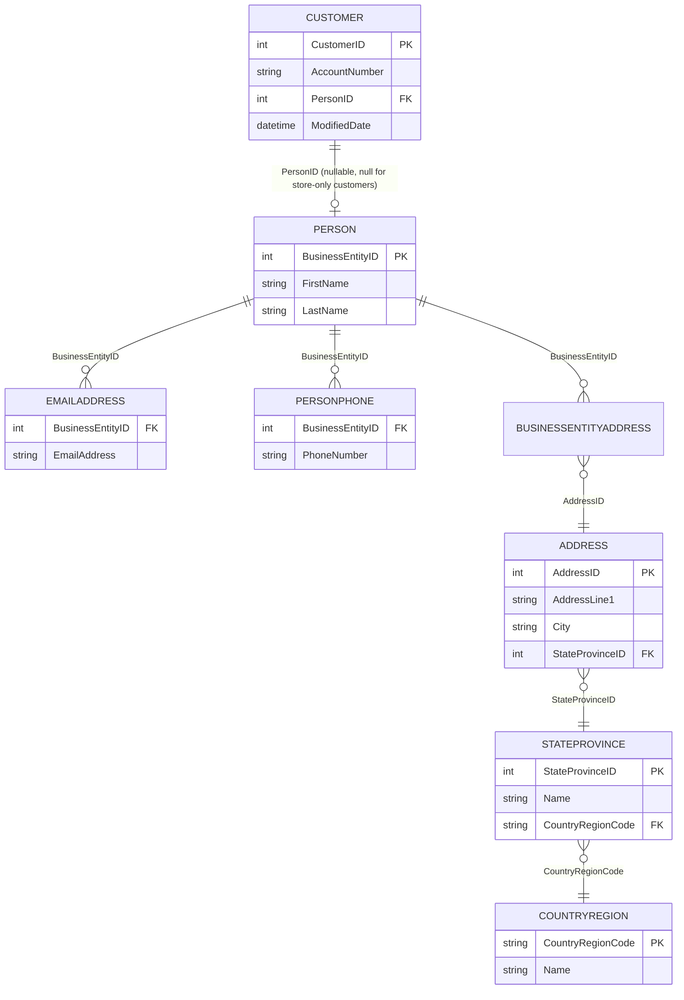
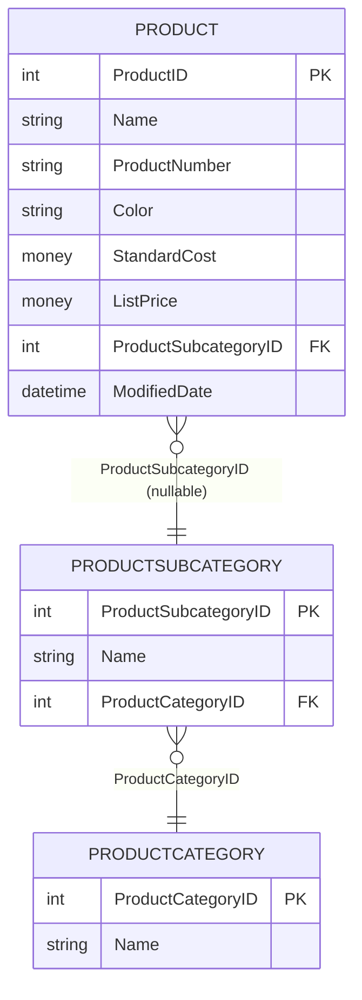
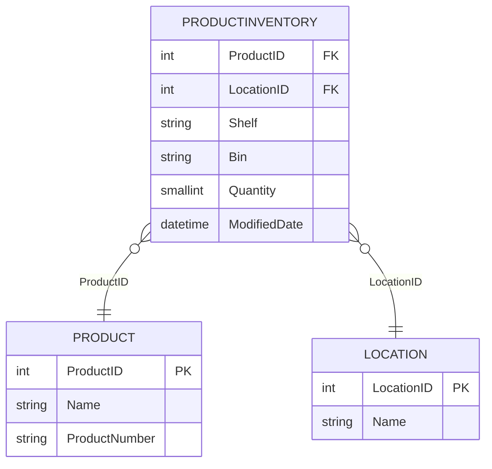
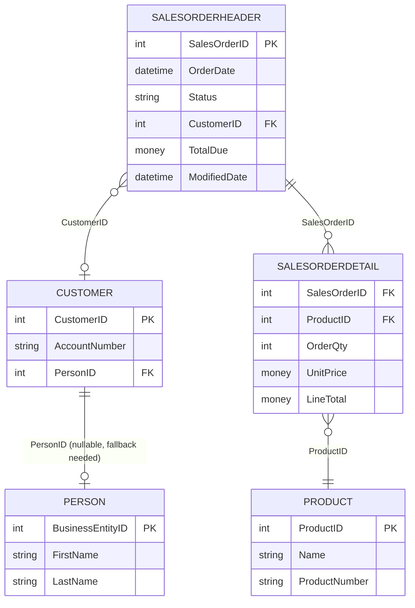

# AdventureWorks Query Design Notes

Validated join/filter logic for the four Sync Agent task types, derived from AdventureWorks schema/FK metadata (`sys.foreign_keys`) provided during planning. These notes are the reference for the EF Core LINQ implementation in `AdventureWorksDbContext` and the per-task repository queries (development plan step 7).

> **Note:** Live execution against a local SQL Server instance was not possible in this session (the `MSSQLSERVER` Windows service is stopped and starting it requires elevated permissions not available in this terminal). The join/filter design below is derived from the full AdventureWorks table/column/FK listing supplied earlier and cross-checked against known AdventureWorks schema conventions. Before committing step 7, run these queries against the live database (via SSMS or `sqlcmd`) to confirm row shapes and no unexpected NULLs.

## Common conventions
- All queries filter on `ModifiedDate >= @modifiedSince` where the task's `parameters["modifiedSince"]` is present and parseable; if missing/unparseable, fall back to returning all rows (or `DateTime.MinValue` as the effective filter), per the base handler's defensive parsing.
- All queries use `AsNoTracking()` — read-only, no change tracking needed.
- Projections go directly to DTOs via `.Select()` rather than materializing full entity graphs, so SQL only requests needed columns.

---

## 1. GetCustomers



**Filter**: `Customer.ModifiedDate >= modifiedSince` AND `Customer.PersonID IS NOT NULL` (store-only customers excluded — result DTO requires `firstName`/`lastName`/`emailAddress` fields per `result-get-customers.json`).

**Join strategy (LINQ)**:
```csharp
var customers = context.Customers
	.AsNoTracking()
	.Where(c => c.ModifiedDate >= modifiedSince && c.PersonId != null)
	.Select(c => new CustomerDto
	{
		CustomerId = c.CustomerId,
		AccountNumber = c.AccountNumber,
		FirstName = c.Person!.FirstName,
		LastName = c.Person.LastName,
		EmailAddress = c.Person.EmailAddresses
			.OrderBy(e => e.EmailAddressId)
			.Select(e => e.EmailAddress)
			.FirstOrDefault(),
		Phone = c.Person.PersonPhones
			.OrderBy(p => p.PhoneNumber)
			.Select(p => p.PhoneNumber)
			.FirstOrDefault(),
		AddressLine1 = c.Person.BusinessEntityAddresses
			.Select(a => a.Address.AddressLine1)
			.FirstOrDefault(),
		City = c.Person.BusinessEntityAddresses
			.Select(a => a.Address.City)
			.FirstOrDefault(),
		StateProvince = c.Person.BusinessEntityAddresses
			.Select(a => a.Address.StateProvince.Name)
			.FirstOrDefault(),
		PostalCode = c.Person.BusinessEntityAddresses
			.Select(a => a.Address.PostalCode)
			.FirstOrDefault(),
		CountryRegion = c.Person.BusinessEntityAddresses
			.Select(a => a.Address.StateProvince.CountryRegion.Name)
			.FirstOrDefault()
	});
```
**Fan-out avoidance**: scalar `.FirstOrDefault()` sub-projections translate to correlated subqueries/`OUTER APPLY`, not `Include()` on collections — avoids duplicated header rows per email/phone/address.

---

## 2. GetProducts



**Filter**: `Product.ModifiedDate >= modifiedSince`.

**Join strategy (LINQ)**:
```csharp
var products = context.Products
	.AsNoTracking()
	.Where(p => p.ModifiedDate >= modifiedSince)
	.Select(p => new ProductDto
	{
		ProductId = p.ProductId,
		Name = p.Name,
		ProductNumber = p.ProductNumber,
		Color = p.Color,
		StandardCost = p.StandardCost,
		ListPrice = p.ListPrice,
		Category = p.ProductSubcategory != null ? p.ProductSubcategory.ProductCategory.Name : null,
		Subcategory = p.ProductSubcategory != null ? p.ProductSubcategory.Name : null,
		ModifiedDate = p.ModifiedDate
	});
```
Simple many-to-one navigations (nullable `ProductSubcategoryId`) — no fan-out risk, single query.

---

## 3. GetProductInventory



**Filter**: `ProductInventory.ModifiedDate >= modifiedSince`.

**Join strategy (LINQ)**:
```csharp
var inventory = context.ProductInventories
	.AsNoTracking()
	.Where(pi => pi.ModifiedDate >= modifiedSince)
	.Select(pi => new ProductInventoryDto
	{
		ProductId = pi.ProductId,
		ProductName = pi.Product.Name,
		ProductNumber = pi.Product.ProductNumber,
		LocationName = pi.Location.Name,
		Shelf = pi.Shelf,
		Bin = pi.Bin,
		Quantity = pi.Quantity,
		ModifiedDate = pi.ModifiedDate
	});
```
Composite-key join (`ProductID`, `LocationID`), single query, no fan-out.

---

## 4. GetOrders



**Filter**: `SalesOrderHeader.ModifiedDate >= modifiedSince`.

**Join strategy (LINQ)** — the only one-to-many fan-out case (header -> many details), use `AsSplitQuery()`:
```csharp
var orders = await context.SalesOrderHeaders
	.AsNoTracking()
	.AsSplitQuery()
	.Where(o => o.ModifiedDate >= modifiedSince)
	.Include(o => o.SalesOrderDetails)
		.ThenInclude(d => d.Product)
	.Include(o => o.Customer!)
		.ThenInclude(c => c!.Person)
	.ToListAsync(ct);

var orderDtos = orders.Select(o => new OrderDto
{
	SalesOrderId = o.SalesOrderId,
	OrderDate = o.OrderDate,
	Status = MapStatus(o.Status),
	CustomerName = o.Customer?.Person != null
		? $"{o.Customer.Person.FirstName} {o.Customer.Person.LastName}"
		: "Unknown", // store-only customer fallback; revisit with Sales.Store if needed
	AccountNumber = o.Customer?.AccountNumber,
	TotalDue = o.TotalDue,
	OrderDetails = o.SalesOrderDetails.Select(d => new OrderDetailDto
	{
		ProductName = d.Product.Name,
		ProductNumber = d.Product.ProductNumber,
		UnitPrice = d.UnitPrice,
		Quantity = d.OrderQty,
		LineTotal = d.LineTotal
	}).ToList()
}).ToList();
```
**Fan-out avoidance**: `AsSplitQuery()` issues separate SQL queries for the `SalesOrderDetails` collection and `Customer`/`Person` navigation instead of one large join, avoiding header-column duplication across every detail row.

**Store-only customer fallback**: `Customer.PersonId` can be null (retail/store customers). Placeholder `"Unknown"` used for now; revisit with a `Sales.Store` join during step 16 implementation if a friendlier name is required by reviewers.

---

## Efficiency verification checklist (for step 20/25)
- [ ] Enable EF Core SQL logging (`.LogTo(...)` or `ILogger` category `Microsoft.EntityFrameworkCore.Database.Command`) during manual E2E testing.
- [ ] Confirm `GetCustomers` produces one query with correlated subqueries, not N+1 per customer.
- [ ] Confirm `GetOrders` with `AsSplitQuery()` issues a small fixed number of queries (not one per order).
- [ ] Confirm all four queries push `ModifiedDate` filtering into SQL `WHERE`, not client-side evaluation.
